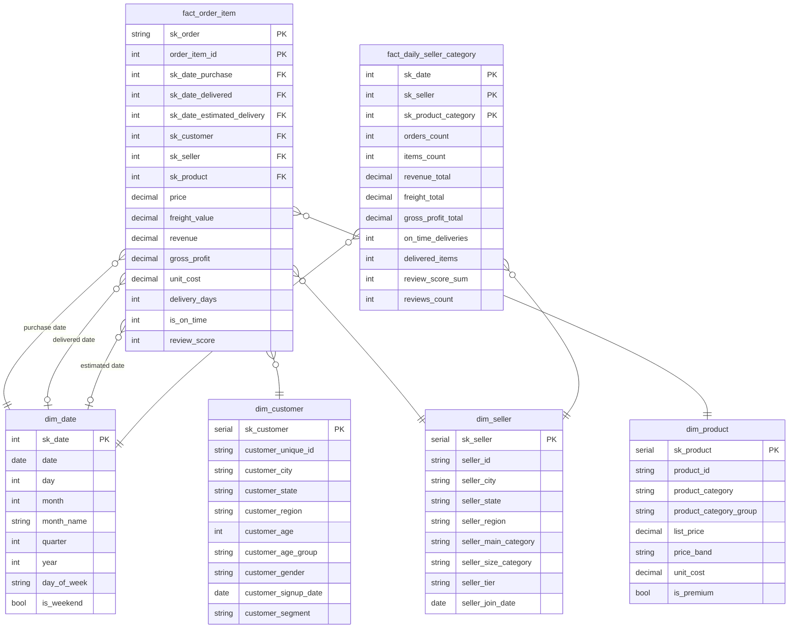
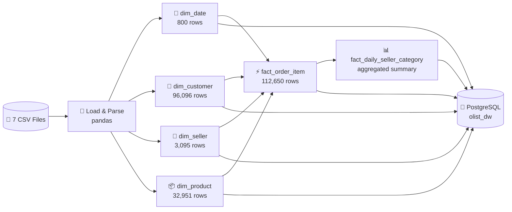
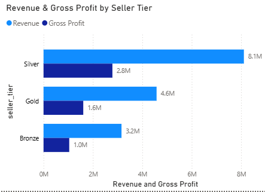
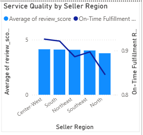
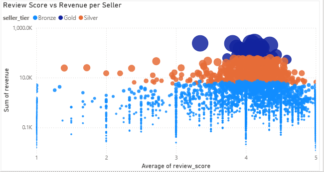
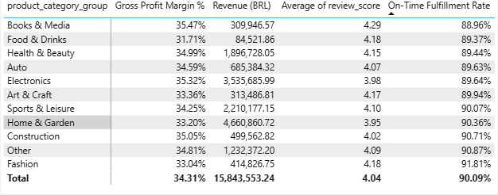
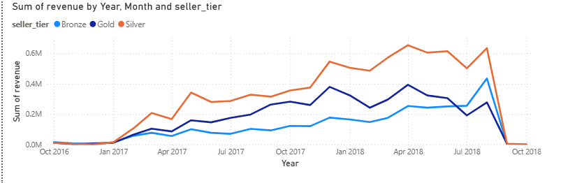

# Olist E-Commerce · Data Warehouse & BI

[](https://python.org)
[](https://postgresql.org)
[](https://powerbi.microsoft.com)
[](https://pandas.pydata.org)

A full data warehouse and BI project built on the [Olist Brazilian E-Commerce dataset](https://www.kaggle.com/datasets/olistbr/brazilian-ecommerce) — ~100,000 real orders placed on Brazil's largest online marketplace between 2016 and 2018.

---

## TODO / Project Status

- [x] Star schema DW design + ETL pipeline
- [x] PostgreSQL schema populated (112,650 fact rows)
- [x] Report A — Seller Performance (Power BI, 5 visuals + slicer)
- [ ] Add report screenshots to `assets/` folder and link them in the Report A section below *(screenshots ready, just need saving to repo)*
- [ ] Report B — Market & Customer Trends *(logic to be finalized)*
- [ ] Dashboard *(logic to be finalized)*
- [ ] OLAP Tool *(logic to be finalized)*

---

## The Raw Data

Seven CSV files from Kaggle form the foundation of this project:

| File | Rows | What it contains |
|---|---|---|
| `olist_customers_dataset.csv` | 99,441 | Customer IDs, city, state |
| `olist_orders_dataset.csv` | 99,441 | Order lifecycle: purchase, approval, delivery, and estimated delivery dates |
| `olist_order_items_dataset.csv` | 112,650 | One row per product per order — price, freight, seller, product |
| `olist_products_dataset.csv` | 32,951 | Product metadata: category name, dimensions, weight |
| `olist_sellers_dataset.csv` | 3,095 | Seller location (city, state) |
| `olist_order_reviews_dataset.csv` | 99,224 | Customer review scores (1–5) per order |
| `product_category_name_translation.csv` | 71 | Portuguese → English category name mapping |

---

## Data Model

The raw data was transformed into a **Star Schema** data warehouse — 4 dimension tables and 2 fact tables:



---

## ETL Pipeline

`etl_load_dw.py` runs the full transformation from raw CSVs to a populated warehouse in one shot:



---

## Field Reference

Every field in the warehouse falls into one of three categories:

> 🟢 **Source** — taken directly from a Kaggle CSV  
> 🔵 **Derived** — computed from source fields during ETL  
> 🟡 **Simulated** — generated synthetically with a fixed random seed (42) for reproducibility

### dim_customer

| Field | Category | Notes |
|---|---|---|
| `sk_customer` | 🔵 Derived | Surrogate key — auto-incremented by the DB |
| `customer_unique_id` | 🟢 Source | Deduplicated from `olist_customers_dataset.csv` |
| `customer_city` | 🟢 Source | |
| `customer_state` | 🟢 Source | |
| `customer_region` | 🔵 Derived | Mapped from state → North / Northeast / Southeast / South / Center-West |
| `customer_age` | 🟡 Simulated | Uniform random 18–70 |
| `customer_age_group` | 🟡 Simulated | Binned from age: 18-24 / 25-34 / 35-44 / 45-54 / 55-64 / 65+ |
| `customer_gender` | 🟡 Simulated | M/F with 48%/52% split |
| `customer_signup_date` | 🟡 Simulated | 60–730 random days before the customer's first order |
| `customer_segment` | 🔵 Derived | Occasional (1 order) / Regular (2–4 orders) / Loyal (5+ orders) |

### dim_seller

| Field | Category | Notes |
|---|---|---|
| `sk_seller` | 🔵 Derived | Surrogate key |
| `seller_id` | 🟢 Source | |
| `seller_city` | 🟢 Source | |
| `seller_state` | 🟢 Source | |
| `seller_region` | 🔵 Derived | Mapped from state |
| `seller_main_category` | 🔵 Derived | Most frequently sold product category |
| `seller_size_category` | 🔵 Derived | Small (<50 items) / Medium (<500) / Large (500+) |
| `seller_tier` | 🔵 Derived | Bronze (<5K revenue) / Silver (<50K) / Gold (50K+) |
| `seller_join_date` | 🟡 Simulated | 30–1095 random days before dataset start (Sep 2016) |

### dim_product

| Field | Category | Notes |
|---|---|---|
| `sk_product` | 🔵 Derived | Surrogate key |
| `product_id` | 🟢 Source | |
| `product_category` | 🔵 Derived | Translated from Portuguese via translation CSV |
| `product_category_group` | 🔵 Derived | Grouped by keyword (Electronics / Fashion / Health & Beauty / etc.) |
| `list_price` | 🔵 Derived | Average sale price across all order items for this product |
| `price_band` | 🔵 Derived | Budget (<50) / Mid (<200) / Premium (<500) / Luxury (500+) |
| `unit_cost` | 🔵 Derived | `list_price × 0.60` — assumes 40% gross margin |
| `is_premium` | 🔵 Derived | `TRUE` if `list_price ≥ 500` |

### fact_order_item _(high granularity — one row per order line)_

The most detailed fact table. Each row represents a single product sold within a single order — the atomic unit of the business. Use this table for any analysis that needs to drill down to individual transactions: product-level profitability, delivery performance per order, review scores, etc.

| Field | Category | Definition |
|---|---|---|
| `sk_order` | 🟢 Source | Order ID from the source system |
| `order_item_id` | 🟢 Source | Line number within the order (1, 2, 3… if the order has multiple products) |
| `sk_date_purchase` | 🔵 Derived | FK → dim_date — the date the customer placed the order |
| `sk_date_delivered` | 🔵 Derived | FK → dim_date — the date the package was actually delivered (nullable) |
| `sk_date_estimated_delivery` | 🔵 Derived | FK → dim_date — the delivery date that was promised to the customer (nullable) |
| `sk_customer` | 🔵 Derived | FK → dim_customer |
| `sk_seller` | 🔵 Derived | FK → dim_seller |
| `sk_product` | 🔵 Derived | FK → dim_product |
| `price` | 🟢 Source | The amount the customer paid for the product itself (excluding shipping) |
| `freight_value` | 🟢 Source | The shipping cost the customer paid for this item |
| `revenue` | 🔵 Derived | `price + freight_value` — total money collected from the customer for this line |
| `unit_cost` | 🔵 Derived | The estimated cost to the seller for this product (`price × 0.60`) |
| `gross_profit` | 🔵 Derived | `price − unit_cost` — profit on the product before operating expenses |
| `delivery_days` | 🔵 Derived | `delivered_date − purchase_date` in calendar days — how long shipping actually took |
| `is_on_time` | 🔵 Derived | `1` if the package arrived on or before the estimated date, `0` if late, `NULL` if not yet delivered |
| `review_score` | 🟢 Source | Customer satisfaction score for the order (1 = worst, 5 = best) |

### fact_daily_seller_category _(low granularity — daily aggregated summary)_

This table answers a different class of questions than `fact_order_item`. Instead of looking at individual transactions, it rolls everything up to the level of **one seller × one product category × one day**. This makes it fast and convenient for trend analysis, seller performance dashboards, and category comparisons over time — without scanning millions of individual order rows.

> **Example use:** "How much revenue did sellers in the Electronics category generate each day in Q4 2017, and what was their on-time delivery rate?"

Every row is built by aggregating the matching rows from `fact_order_item`. The `sk_product_category` is an integer ID (assigned alphabetically) that maps to the category name in `dim_product`.

| Field | Category | Definition |
|---|---|---|
| `sk_date` | 🔵 Derived | FK → dim_date — the purchase date of the aggregated orders |
| `sk_seller` | 🔵 Derived | FK → dim_seller |
| `sk_product_category` | 🔵 Derived | Integer ID for the product category (alphabetically assigned; join to dim_product to get the name) |
| `orders_count` | 🔵 Derived | Number of distinct orders placed |
| `items_count` | 🔵 Derived | Total number of individual items sold |
| `revenue_total` | 🔵 Derived | Sum of `revenue` across all matching order lines |
| `freight_total` | 🔵 Derived | Sum of `freight_value` — total shipping collected |
| `gross_profit_total` | 🔵 Derived | Sum of `gross_profit` — total product profit for the day |
| `on_time_deliveries` | 🔵 Derived | Count of items where `is_on_time = 1` |
| `delivered_items` | 🔵 Derived | Count of items that have a recorded delivery date |
| `review_score_sum` | 🔵 Derived | Sum of all review scores (divide by `reviews_count` to get the average) |
| `reviews_count` | 🔵 Derived | Number of items that received a review |

---

## Getting Started

<details>
<summary><b>1 — Install Python packages</b></summary>
<br>

```bash
pip install pandas psycopg2-binary numpy python-dotenv
```
</details>

<details>
<summary><b>2 — Download the dataset</b></summary>
<br>

1. Go to https://www.kaggle.com/datasets/olistbr/brazilian-ecommerce
2. Download and extract the ZIP
3. Place all 7 CSV files in this folder (next to `etl_load_dw.py`)
</details>

<details>
<summary><b>3 — Set up PostgreSQL</b></summary>
<br>

1. Install [PostgreSQL](https://www.postgresql.org/download/) and open pgAdmin
2. Open the Query Tool and run the full contents of `olist_dw_schema.sql`
</details>

<details>
<summary><b>4 — Add your database connection</b></summary>
<br>

Create a file named `.env` in this folder:

```
PG_DSN=dbname=postgres user=postgres password=YOUR_PASSWORD host=127.0.0.1 port=5432
```

This file is excluded from Git and will never be pushed to GitHub.
</details>

<details>
<summary><b>5 — Run the ETL</b></summary>
<br>

```bash
python etl_load_dw.py
```

Takes about 1–2 minutes. Prints a row count per table when done.
</details>

---

## What's in this repo

| File | Purpose |
|---|---|
| `etl_load_dw.py` | Full ETL pipeline: CSVs → transform → PostgreSQL |
| `olist_dw_schema.sql` | DDL — creates the `olist_dw` schema and all 6 tables |
| `olist_dw_erd.drawio` | Interactive star schema diagram (open with [draw.io](https://app.diagrams.net)) |
| `olist_dw_erd.png` | Diagram as a static image |
| `.env` | Your local DB credentials — **not included in Git** |

---

> CSV files, `.env`, and generated documents are excluded via `.gitignore`.

---

## Report A — Seller Performance

The question this report tries to answer: which sellers are pulling their weight, and which ones are a liability? Built for Olist's seller operations team, it covers revenue distribution, service quality by region, individual seller behavior, category breakdowns, and growth over time.

There's one slicer on Page 1 — a Year filter (2016 / 2017 / 2018) — that updates all visuals on that page simultaneously.

The report is split across two pages:
- **Page 1** — snapshot view (tiers, regions, scatter, category matrix)
- **Page 2** — trend view (monthly revenue over time + service quality by region)

---

### Visual 1 — Revenue & Gross Profit by Seller Tier



Sellers are split into three revenue brackets: Bronze (<5K BRL total), Silver (5K–50K), Gold (50K+). The chart shows total revenue and gross profit side by side per tier.

Silver is the biggest revenue driver at 8.1M BRL — more than Gold (4.6M). Not because individual Silver sellers are larger, but because there are far more of them. The platform's volume runs on Silver, not on the handful of Gold sellers at the top.

> Gross profit uses a simulated cost model (`price × 0.60`) — treat these as directional estimates, not accounting figures.

---

### Visual 2 — Service Quality by Seller Region



Two metrics on one chart: bars show average review score (left axis), the line tracks on-time fulfillment rate (right axis). On-time fulfillment rate = orders delivered on time ÷ **all** orders placed, including ones that were never delivered.

The North region is consistently at the bottom on both metrics — ~3.8 stars and ~80% on-time vs Center-West's ~4.1 stars and ~95%. Both metrics pointing the same direction for the same region is a logistics signal, not a product quality issue. Brazil's North is geographically remote and delivery distances are longer.

---

### Visual 3 — Review Score vs Revenue per Seller



Each dot is one seller. X = their average review score, Y = their total revenue. Color = tier.

The Y-axis is logarithmic — seller revenues range from a few hundred BRL to over a million, so a regular scale would squash Bronze sellers into an invisible line at the bottom. Log scale keeps all three tiers readable without changing the actual values (1,000K = 1M).

Gold sellers mostly cluster top-right, which is fine. The ones worth flagging are the Gold sellers sitting around score 3 — strong revenue, mediocre satisfaction. They're bringing in money while quietly damaging Olist's ratings on Mercado Livre and other partner platforms. Bronze sellers are all over the place — some have great scores but haven't scaled yet. Those are the growth candidates.

---

### Visual 4 — Category Performance Overview



A scorecard across 11 product category groups. Four columns: gross profit margin, total revenue, average review score, on-time fulfillment rate.

A few things stand out:
- **Home & Garden** has the most revenue (4.66M BRL) but the lowest review score (3.95) — being the biggest category doesn't mean the best experience
- **Books & Media** has the highest review score (4.29) and the lowest revenue — niche but happy
- **Fashion** leads on on-time rate (91.8%) and has solid reviews — the most operationally clean category
- Gross profit margins look nearly identical across categories (~33–35%) — this is expected given the simulated cost model, not real differentiation

---

### Visual 5 — Monthly Revenue Trend by Seller Tier



Monthly revenue from Oct 2016 to Oct 2018, split by tier. All three lines grow steadily throughout the period, with Silver consistently on top. There's a visible bump around November 2017 — Black Friday.

The drop at the very end is a data artifact. The dataset ends mid-period in late 2018, so the last one or two months have fewer orders than a complete month would. It's not a real trend reversal.
