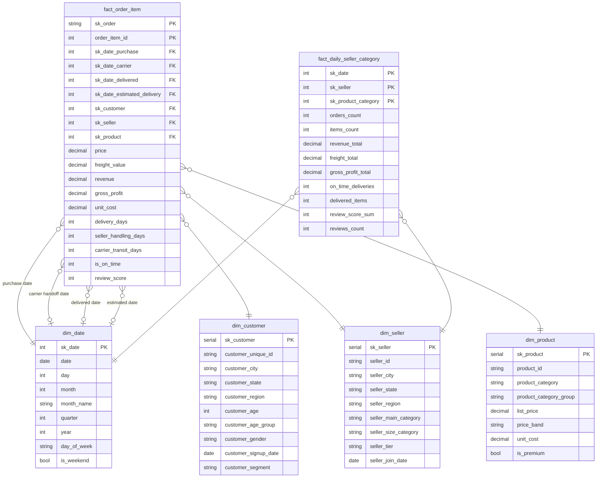
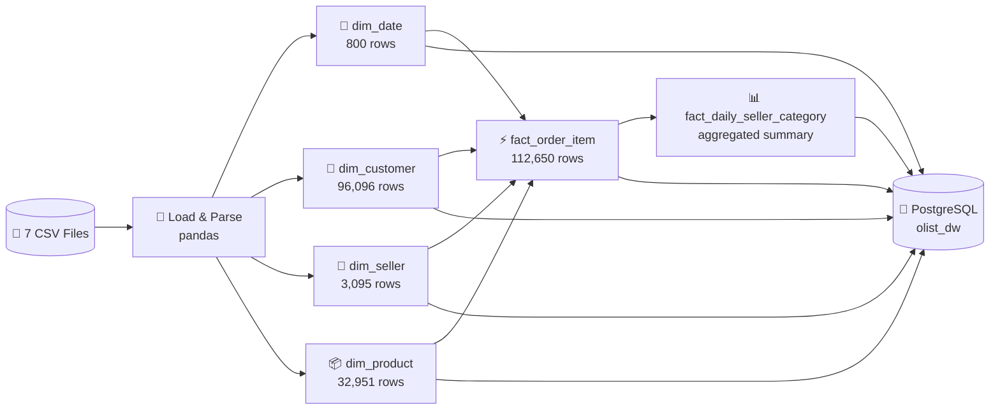
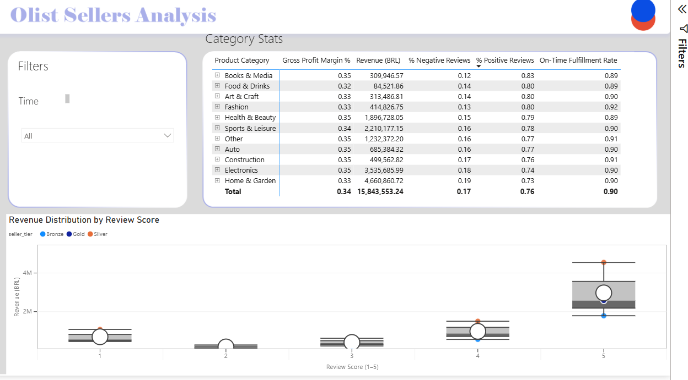

# Olist E-Commerce · Data Warehouse & BI

[](https://python.org)
[](https://postgresql.org)
[](https://powerbi.microsoft.com)
[](https://pandas.pydata.org)
[](#data-model)
[](#the-raw-data)

A full data warehouse and BI project built on the [Olist Brazilian E-Commerce dataset](https://www.kaggle.com/datasets/olistbr/brazilian-ecommerce) — ~100,000 real orders placed on Brazil's largest online marketplace between 2016 and 2018.

> ### 🎯 The one-sentence story
> **Slow delivery tracks with unhappy customers — and ~80% of that delivery time lives with the *carrier*, not the seller.** This project builds the warehouse, models the two delivery phases, and turns that finding into a single decision: *fix logistics, not seller onboarding.*

<table>
<tr>
<td align="center"><b>~100K</b><br/>real orders</td>
<td align="center"><b>112,650</b><br/>fact rows</td>
<td align="center"><b>6 tables</b><br/>4 dims · 2 facts</td>
<td align="center"><b>19 → 10 days</b><br/>delivery, 1★ vs 5★</td>
<td align="center"><b>~80%</b><br/>of the gap is carrier-side</td>
</tr>
</table>

> **This is not a tutorial clone.** Every visual was re-examined against measurement-scale theory, a real reconciliation bug was caught and proven at the row level, and each design decision is documented with *why the previous version was wrong* — see [Design evolution](#design-evolution--measurement-scales--the-blank-fix).

---

## 🧰 What this project demonstrates

| Competency | Where to see it |
|---|---|
| **Dimensional modelling** (Kimball star schema, surrogate keys, grain choice) | [Data Model](#data-model) · two fact grains (atomic + daily aggregate) |
| **Reproducible ETL** (pandas → PostgreSQL, fixed seed, idempotent reload) | [`etl_load_dw.py`](etl_load_dw.py) · [ETL Pipeline](#etl-pipeline) |
| **Data integrity instinct** (caught `floor(a)+floor(b)≠floor(a+b)`, proved it at row level, fixed by construction) | [Design evolution · step 5](#design-evolution--measurement-scales--the-blank-fix) |
| **Measurement-scale literacy** (ordinal vs ratio → right chart, right statistic) | scatter → box-plot redesign in [Design evolution](#design-evolution--measurement-scales--the-blank-fix) |
| **Honest analytics** (association vs causation, simulated-data disclosure) | [Known limitations](#known-limitations-be-honest-at-the-defense) |
| **BI storytelling** (one page, one question, coordinated cross-filtering) | [Report A](#report-a--olist-sellers-analysis) |

---

## Project status

| Deliverable | Status |
|---|---|
| **Dimensional warehouse + reproducible ETL** | ✅ 6 tables · 112,650 fact rows |
| **Report A** — Delivery accountability (seller vs carrier) | ✅ Complete |
| **Report B** — Regional freight & cost-to-serve | ✅ Built |
| **OLAP** — Regional fulfilment & growth explorer | 🛠 In progress |
| **Executive KPI dashboard** | 📋 Planned |

---

## The Raw Data

Seven CSV files from Kaggle form the foundation of this project:

| File | Rows | What it contains |
|---|---|---|
| `olist_customers_dataset.csv` | 99,441 | Customer IDs, city, state |
| `olist_orders_dataset.csv` | 99,441 | Order lifecycle: purchase, approval, delivery, and estimated delivery dates |
| `olist_order_items_dataset.csv` | 112,650 | One row per product per order — price, freight, seller, product |
| `olist_products_dataset.csv` | 32,951 | Product metadata: category name, dimensions, weight |
| `olist_sellers_dataset.csv` | 3,095 | Seller location (city, state) |
| `olist_order_reviews_dataset.csv` | 99,224 | Customer review scores (1–5) per order |
| `product_category_name_translation.csv` | 71 | Portuguese → English category name mapping |

---

## Data Model

The raw data was transformed into a **Star Schema** data warehouse — 4 dimension tables and 2 fact tables:


```mermaid
erDiagram
    dim_date {
        int sk_date PK
        date date
        int day
        int month
        string month_name
        int quarter
        int year
        string day_of_week
        bool is_weekend
    }
    dim_customer {
        serial sk_customer PK
        string customer_unique_id
        string customer_city
        string customer_state
        string customer_region
        int customer_age
        string customer_age_group
        string customer_gender
        date customer_signup_date
        string customer_segment
    }
    dim_seller {
        serial sk_seller PK
        string seller_id
        string seller_city
        string seller_state
        string seller_region
        string seller_main_category
        string seller_size_category
        string seller_tier
        date seller_join_date
    }
    dim_product {
        serial sk_product PK
        string product_id
        string product_category
        string product_category_group
        decimal list_price
        string price_band
        decimal unit_cost
        bool is_premium
    }
    fact_order_item {
        string sk_order PK
        int order_item_id PK
        int sk_date_purchase FK
        int sk_date_carrier FK
        int sk_date_delivered FK
        int sk_date_estimated_delivery FK
        int sk_customer FK
        int sk_seller FK
        int sk_product FK
        decimal price
        decimal freight_value
        decimal revenue
        decimal gross_profit
        decimal unit_cost
        int delivery_days
        int seller_handling_days
        int carrier_transit_days
        int is_on_time
        int review_score
    }
    fact_daily_seller_category {
        int sk_date PK
        int sk_seller PK
        int sk_product_category PK
        int orders_count
        int items_count
        decimal revenue_total
        decimal freight_total
        decimal gross_profit_total
        int on_time_deliveries
        int delivered_items
        int review_score_sum
        int reviews_count
    }

    fact_order_item }o--|| dim_date : "purchase date"
    fact_order_item }o--o| dim_date : "carrier handoff date"
    fact_order_item }o--o| dim_date : "delivered date"
    fact_order_item }o--o| dim_date : "estimated date"
    fact_order_item }o--|| dim_customer : ""
    fact_order_item }o--|| dim_seller : ""
    fact_order_item }o--|| dim_product : ""
    fact_daily_seller_category }o--|| dim_date : ""
    fact_daily_seller_category }o--|| dim_seller : ""
```

---

## ETL Pipeline

`etl_load_dw.py` runs the full transformation from raw CSVs to a populated warehouse in one shot:


```mermaid
flowchart LR
    A[("📂 7 CSV Files")] --> B["🔄 Load & Parse\npandas"]
    B --> C1["📅 dim_date\n800 rows"]
    B --> C2["👤 dim_customer\n96,096 rows"]
    B --> C3["🏪 dim_seller\n3,095 rows"]
    B --> C4["📦 dim_product\n32,951 rows"]
    C1 & C2 & C3 & C4 --> D["⚡ fact_order_item\n112,650 rows"]
    D --> E["📊 fact_daily_seller_category\naggregated summary"]
    C1 & C2 & C3 & C4 & D & E --> F[("🐘 PostgreSQL\nolist_dw")]
```

---

## Field Reference

Every field in the warehouse falls into one of three categories:

> 🟢 **Source** — taken directly from a Kaggle CSV  
> 🔵 **Derived** — computed from source fields during ETL  
> 🟡 **Simulated** — generated synthetically with a fixed random seed (42) for reproducibility

### dim_customer

| Field | Category | Notes |
|---|---|---|
| `sk_customer` | 🔵 Derived | Surrogate key — auto-incremented by the DB |
| `customer_unique_id` | 🟢 Source | Deduplicated from `olist_customers_dataset.csv` |
| `customer_city` | 🟢 Source | |
| `customer_state` | 🟢 Source | |
| `customer_region` | 🔵 Derived | Mapped from state → North / Northeast / Southeast / South / Center-West |
| `customer_age` | 🟡 Simulated | Uniform random 18–70 |
| `customer_age_group` | 🟡 Simulated | Binned from age: 18-24 / 25-34 / 35-44 / 45-54 / 55-64 / 65+ |
| `customer_gender` | 🟡 Simulated | M/F with 48%/52% split |
| `customer_signup_date` | 🟡 Simulated | 60–730 random days before the customer's first order |
| `customer_segment` | 🔵 Derived | Occasional (1 order) / Regular (2–4 orders) / Loyal (5+ orders) |

### dim_seller

| Field | Category | Notes |
|---|---|---|
| `sk_seller` | 🔵 Derived | Surrogate key |
| `seller_id` | 🟢 Source | |
| `seller_city` | 🟢 Source | |
| `seller_state` | 🟢 Source | |
| `seller_region` | 🔵 Derived | Mapped from state |
| `seller_main_category` | 🔵 Derived | Most frequently sold product category |
| `seller_size_category` | 🔵 Derived | Small (<50 items) / Medium (<500) / Large (500+) |
| `seller_tier` | 🔵 Derived | Bronze (<5K revenue) / Silver (<50K) / Gold (50K+) |
| `seller_join_date` | 🟡 Simulated | 30–1095 random days before dataset start (Sep 2016) |
| `seller_plan` | 🟡 Simulated | Subscription plan by sales volume: Free / Starter / Pro / Enterprise |
| `subscription_fee_monthly` | 🟡 Simulated | Monthly SaaS fee (BRL): 0 / 99 / 299 / 699 |
| `commission_rate` | 🟡 Simulated | Marketplace commission on item price: 20% / 16% / 13% / 10% |
| `payment_rate` | 🟡 Simulated | Payment-processing rate: 2.97% / 2.87% / 2.77% / 2.47% |
| `active_months` | 🔵 Derived | Inclusive month span of seller activity (months billed) |
| `subscription_revenue_total` | 🔵 Derived | `subscription_fee_monthly × active_months` |

> **💡 Olist revenue model (synthetic).** Olist's real revenue is *not* the item price — that's **GMV** (the seller's money). Olist earns **commission + a R$5/item fee + payment processing + SaaS subscriptions**. The plan, fees and commission/payment rates above are **synthetically generated (fixed seed 42)**, modelled on Olist's published pricing and assigned by seller sales volume. Only the **R$5/item fee is exact**. These power the *Take Rate* and Olist-revenue measures; the SaaS/platform-fee streams that require seller-plan data we don't have are approximated or omitted, and disclosed as such.

### dim_product

| Field | Category | Notes |
|---|---|---|
| `sk_product` | 🔵 Derived | Surrogate key |
| `product_id` | 🟢 Source | |
| `product_category` | 🔵 Derived | Translated from Portuguese via translation CSV |
| `product_category_group` | 🔵 Derived | Grouped by keyword (Electronics / Fashion / Health & Beauty / etc.) |
| `list_price` | 🔵 Derived | Average sale price across all order items for this product |
| `price_band` | 🔵 Derived | Budget (<50) / Mid (<200) / Premium (<500) / Luxury (500+) |
| `unit_cost` | 🔵 Derived | `list_price × 0.60` — assumes 40% gross margin |
| `is_premium` | 🔵 Derived | `TRUE` if `list_price ≥ 500` |

### fact_order_item _(high granularity — one row per order line)_

The most detailed fact table. Each row represents a single product sold within a single order — the atomic unit of the business. Use this table for any analysis that needs to drill down to individual transactions: product-level profitability, delivery performance per order, review scores, etc.

| Field | Category | Definition |
|---|---|---|
| `sk_order` | 🟢 Source | Order ID from the source system |
| `order_item_id` | 🟢 Source | Line number within the order (1, 2, 3… if the order has multiple products) |
| `sk_date_purchase` | 🔵 Derived | FK → dim_date — the date the customer placed the order |
| `sk_date_carrier` | 🔵 Derived | FK → dim_date — the date the seller handed the package to the carrier (the seller→carrier handoff, nullable) |
| `sk_date_delivered` | 🔵 Derived | FK → dim_date — the date the package was actually delivered (nullable) |
| `sk_date_estimated_delivery` | 🔵 Derived | FK → dim_date — the delivery date that was promised to the customer (nullable) |
| `sk_customer` | 🔵 Derived | FK → dim_customer |
| `sk_seller` | 🔵 Derived | FK → dim_seller |
| `sk_product` | 🔵 Derived | FK → dim_product |
| `price` | 🟢 Source | The amount the customer paid for the product itself (excluding shipping) |
| `freight_value` | 🟢 Source | The shipping cost the customer paid for this item |
| `revenue` | 🔵 Derived | `price + freight_value` — total money collected from the customer for this line |
| `unit_cost` | 🔵 Derived | The estimated cost to the seller for this product (`price × 0.60`) |
| `gross_profit` | 🔵 Derived | `price − unit_cost` — profit on the product before operating expenses |
| `delivery_days` | 🔵 Derived | `delivered_date − purchase_date` in calendar days — total shipping time |
| `seller_handling_days` | 🔵 Derived | `carrier_handoff − purchase_date` — the **seller-owned** phase (prep, pack, post), nullable |
| `carrier_transit_days` | 🔵 Derived | `delivered_date − carrier_handoff` — the **carrier-owned** phase (collection, transit, last-mile), nullable |
| `is_on_time` | 🔵 Derived | `1` if the package arrived on or before the estimated date, `0` if late, `NULL` if not yet delivered |
| `review_score` | 🟢 Source | Customer satisfaction score for the order (1 = worst, 5 = best) |

### fact_daily_seller_category _(low granularity — daily aggregated summary)_

This table answers a different class of questions than `fact_order_item`. Instead of looking at individual transactions, it rolls everything up to the level of **one seller × one product category × one day**. This makes it fast and convenient for trend analysis, seller performance dashboards, and category comparisons over time — without scanning millions of individual order rows.

> **Example use:** "How much revenue did sellers in the Electronics category generate each day in Q4 2017, and what was their on-time delivery rate?"

Every row is built by aggregating the matching rows from `fact_order_item`. The `sk_product_category` is an integer ID (assigned alphabetically) that maps to the category name in `dim_product`.

| Field | Category | Definition |
|---|---|---|
| `sk_date` | 🔵 Derived | FK → dim_date — the purchase date of the aggregated orders |
| `sk_seller` | 🔵 Derived | FK → dim_seller |
| `sk_product_category` | 🔵 Derived | Integer ID for the product category (alphabetically assigned; join to dim_product to get the name) |
| `orders_count` | 🔵 Derived | Number of distinct orders placed |
| `items_count` | 🔵 Derived | Total number of individual items sold |
| `revenue_total` | 🔵 Derived | Sum of `revenue` across all matching order lines |
| `freight_total` | 🔵 Derived | Sum of `freight_value` — total shipping collected |
| `gross_profit_total` | 🔵 Derived | Sum of `gross_profit` — total product profit for the day |
| `on_time_deliveries` | 🔵 Derived | Count of items where `is_on_time = 1` |
| `delivered_items` | 🔵 Derived | Count of items that have a recorded delivery date |
| `review_score_sum` | 🔵 Derived | Sum of all review scores (divide by `reviews_count` to get the average) |
| `reviews_count` | 🔵 Derived | Number of items that received a review |

---

## Run it locally

<details>
<summary><b>Setup &amp; run</b> — ≈2 minutes</summary>
<br>

```bash
# 1 · dependencies
pip install pandas psycopg2-binary numpy python-dotenv

# 2 · data — place the 7 Olist CSVs next to etl_load_dw.py
#     https://www.kaggle.com/datasets/olistbr/brazilian-ecommerce

# 3 · schema — run the DDL on your PostgreSQL instance
psql -f olist_dw_schema.sql

# 4 · credentials — create .env (gitignored)
#     PG_DSN=dbname=postgres user=postgres password=*** host=127.0.0.1 port=5432

# 5 · build the warehouse (~1–2 min, prints a row count per table)
python etl_load_dw.py
```
</details>

---

## What's in this repo

| File | Purpose |
|---|---|
| `etl_load_dw.py` | Full ETL pipeline: CSVs → transform → PostgreSQL |
| `olist_dw_schema.sql` | DDL — creates the `olist_dw` schema and all 6 tables |
| `olist_dw_erd.drawio` | Interactive star schema diagram (open with [draw.io](https://app.diagrams.net)) |
| `olist_dw_erd.png` | Diagram as a static image |
| `.env` | Your local DB credentials — **not included in Git** |

---

> CSV files, `.env`, and generated documents are excluded via `.gitignore`.

---

## Report A — Olist Sellers Analysis



### Purpose
A single-page Power BI report built for Olist's **seller operations team**. It answers one tight, actionable question: *where should Olist focus fulfillment improvement in order to reduce customer dissatisfaction?*

Every visual converges on delivery performance. The report first shows that lower review scores are associated with longer delivery times. It then decomposes total delivery time into **seller handling time** and **carrier transit time**, helping identify whether the main operational bottleneck is created before carrier handoff or during carrier transit. In the current analysis, the larger share of delivery time appears to come from carrier transit, suggesting that the primary improvement focus should be **logistics-partner performance** rather than seller preparation.

### Structure
One page, one global filter, and three coordinated visuals where the matrix drives the rest:

| Element | Role |
|---|---|
| **Filter** — *Time Period* | Global slicer that cascades through every visual on the page. |
| **Category Stats** (hierarchical matrix) | Primary analytical view **and the page's category filter**: clicking a *Product Category* row cross-filters the other visuals to that category — replacing a separate category slicer. Columns show Revenue (BRL), seller-count share, **% Positive Reviews (≥4★)**, On-Time Fulfillment Rate, and **average delivery days**. Lets a manager line up revenue, satisfaction, and fulfilment speed for every category at a glance. |
| **Delivery Time Breakdown by Category** (stacked column) | Average delivery days per category, split into the **seller-handling** and **carrier-transit** phases. Replaced an earlier revenue pie. The dark carrier segment dominates every bar — making the accountability split impossible to miss. |
| **Delivery Days Distribution by Review Score** (box plot) | Distribution of delivery time (ratio-scale) across review scores 1–5 (ordinal), colored by tier. The report's headline visual: it isolates *delivery speed* as a controllable driver of satisfaction. Replaced an earlier scatter that incorrectly treated the ordinal review score as a continuous axis (see *Design evolution* below). |

### Design principles
- **One theme, one page** — every visual is about *delivery performance*. No mixed messaging.
- **Filter-first layout** — the Time Period slicer sits top-left where managers look first; category filtering is driven by clicking matrix rows.
- **Consistent phase color coding** — seller-handling and carrier-transit use the same two colors across the breakdown chart, and tier colors are consistent in the box plot.
- **Hierarchical drill in the matrix** — keeps the visual count low without losing depth.
- **Scale-correct measures** — review score is treated as **ordinal**: the matrix reports *% Positive Reviews (≥4★)*, a frequency-based ratio, instead of an arithmetic mean of 1–5 scores. `delivery_days` is ratio-scale, so its mean *is* valid and is shown directly.

### Decisions supported
- **Tier promotion / demotion** — spot Silver sellers with Gold-tier metrics, or Gold sellers with Bronze-tier reviews.
- **Category investment** — identify categories where margin is healthy *and* satisfaction is strong (expand) vs. high-revenue / low-satisfaction categories (operational fix).
- **High-risk category flagging** — clicking a category row in the matrix filters the box plot, exposing categories whose revenue concentrates in low review scores — sellers who generate revenue while damaging the platform's marketplace reputation.

### What the report reveals

> 📦 **Headline:** lower review scores are associated with **longer delivery times** — median delivery falls monotonically from **~19 days at 1★ to ~10 days at 5★**. Fulfilment speed is the strongest *controllable* signal on this page — a place to investigate, not yet a proven cause.

- **Lower review scores are associated with longer delivery times — the headline finding.** In the box plot, median delivery time decreases monotonically as review score rises: ~19 days at score 1 down to ~10 days at score 5. This is a strong association that points to fulfilment speed as a promising area to investigate — not a proven cause of dissatisfaction (see *Known limitations*).
- **Most of the delivery time sits in the *carrier* phase, not the *seller* phase.** Splitting total delivery time into its two ownership phases — *seller handling* (purchase → carrier handoff) and *carrier transit* (handoff → customer) — shows the carrier phase accounts for the larger share of both the absolute time and the spread that tracks with review score. Across the 1★→5★ range, seller handling decreases 4.2 → 2.4 days (Δ 1.8) while carrier transit decreases 15.0 → 7.8 days (Δ 7.2) — so **~80% of the delivery-time difference between low- and high-rated orders is carrier-side**. This suggests fulfilment-improvement effort is better directed at logistics-partner performance than at seller preparation.
- **The breakdown chart shows the split is consistent across *every* category.** The stacked column shows the carrier-transit segment exceeding the seller-handling base across all ten categories — Home & Garden and Electronics are highest (~12.5 avg days), Food & Drinks lowest (~9.7). Because the pattern is consistent across categories, it is unlikely to be driven by *product mix* alone — it looks like a platform-wide logistics pattern rather than a few outlier categories.
- **Satisfaction varies far more than fulfilment-rate.** % Positive ranges from ~0.73 (Home & Garden) to ~0.83 (Books & Media) while the on-time rate sits at a flat ~0.90 for almost every category — suggesting that *how long* delivery takes, not just whether it beats the (padded) estimate, may matter more to customers.

### Known limitations (be honest at the defense)
- **Gross margin is simulated.** `unit_cost = list_price × 0.60` in the DW (fixed 40% assumption) — which is why margin was dropped from the final matrix in favour of delivery and satisfaction metrics that are grounded in real source data.
- **No geographic dimension** in this report — regional analysis lives in Report B by design, but the seller team will sometimes ask "where are these sellers?" and the report has to defer (and a carrier problem is very likely regional).
- **Delivery time and satisfaction are associated, not proven causal.** The box plot shows a strong monotonic association between longer delivery times and lower review scores — but association is not causation. Confounders (category, season, region, price) are not fully controlled, so the report deliberately frames delivery as *where to investigate and focus improvement*, not as a demonstrated cause. The category breakdown makes *product mix* a less likely sole explanation, and the temporal order (delivery precedes the review) makes reverse causation unlikely — but only an experiment or multivariate model could establish cause.

### Design evolution — measurement scales & the "(Blank)" fix

Part of this project is showing *how the visuals improved*, not just the final state. Visual 3 went through three steps worth documenting.

**1 — From scatter to box plot (a measurement-scale fix).**
The first version plotted *review score* (X) against *revenue* (Y) as a **scatter** ("relationship") chart. That is formally incorrect: a scatter relationship chart needs **two ratio-scale fact variables**, but `review_score` is **ordinal** — its order is meaningful, yet the gaps (3→4 vs 4→5) are not quantitatively equal. The old title also referenced the *average* of review scores, and the mean is only valid for interval/ratio data; ordinal data calls for median, mode, rank, percentiles, or a distribution view.

The redesign uses a **box-and-whisker** chart — the course-correct way to compare the **distribution of a ratio-scale fact** across an **ordinal dimension (review score)**, colored by seller tier. (Power BI ships no native box plot, so the certified *Box and Whisker chart* by MAQ Software was imported via **Get more visuals**.)

> The original scatter is preserved at [assets/report_a_v3_scatter.png](assets/report_a_v3_scatter.png) as a record of the correction.

**2 — Why a "(Blank)" category appeared, and how it was removed.**


The first box plot showed **six** categories on the review-score axis: `(Blank), 1, 2, 3, 4, 5`. The `(Blank)` box is **order items with no review score**.

- **Root cause:** `review_score` is nullable (`SMALLINT`, no `NOT NULL`). In `etl_load_dw.py`, reviews are attached with a **left join** (`fact.merge(rev, on="order_id", how="left")`). The Olist source has reviews for only ~99,224 of 112,650 order items, so every item from an un-reviewed order gets `review_score = NULL`. Power BI buckets all NULLs into one `(Blank)` category. It is **not a data error** — it faithfully represents *"items that never received a customer review."*
- **Fix:** a **visual-level filter** on `review_score` unchecks `(Blank)` (keeps 1–5). This removes the noise from this chart only, leaves the NULLs available to other visuals, and is fully reversible — so the warehouse is never altered for a presentation concern.

**3 — From *revenue* to *delivery days* (a sharper business question).**
The box plot first compared **revenue** across review scores — valid, but it only restated a known correlation (happy customers spend a bit more). Swapping the Y-axis to **delivery days** reframes the same chart around a lever management actually controls: the monotonic drop from ~19 days (score 1) to ~10 days (score 5) makes *fulfilment speed* the headline driver of satisfaction. Same measurement-scale logic (ratio fact across ordinal dimension), far more actionable insight.

**4 — Page-level pivot: from "who earns" to "who's accountable".**
The companion visual started as a **revenue-share pie** (Bronze/Silver/Gold) and the matrix carried a simulated *Gross Profit Margin %*. Both were dropped: the pie answered a different question than the delivery story, and the margin column was simulated (fixed 40% cost), so it added noise rather than signal. They were replaced by the **Delivery Time Breakdown by Category** stacked column (seller vs carrier phases) and an *average delivery days* matrix column — unifying the whole page around one defensible, source-grounded theme: **delivery performance and who owns it.**

**5 — A reconciliation bug caught by reading the report carefully (`floor(a) + floor(b) ≠ floor(a+b)`).**
After the breakdown chart went live, the average delivery days shown in the *matrix* (12.01) did **not** match the stacked-bar total of the two phases (11.53) — a ~0.47-day gap in **every** category. Rather than wave it away, I decomposed it at the row level.

Each metric was computed independently from timestamps using pandas `Timedelta.days`, which **floors to whole days**:

```python
delivery_days        = (delivered - purchase).days     # floored once
seller_handling_days = (handoff   - purchase).days     # floored
carrier_transit_days = (delivered - handoff).days      # floored again
```

As *timedeltas*, `(handoff − purchase) + (delivered − handoff)` equals `(delivered − purchase)` exactly — but **`floor(a) + floor(b) ≤ floor(a + b)`**. Flooring the two sub-phases discards a fractional day from *each*, while the total floors only once. The proof is in the per-row residual `delivery − seller − carrier`, which on all 110,195 fully-delivered rows took **only the values {0, 1}** — 0 in 57,366 rows, 1 in 52,829 — averaging exactly **0.479 days**, which *is* the entire gap. A residual mathematically bounded to {0, 1} is the unmistakable fingerprint of double-flooring; it rules out join fan-out, a unit error, or a second data source.

**Fix** — define the final phase as the *remainder* of the single-floored authoritative total, so the parts reconcile by construction on every row:

```python
carrier_transit_days = delivery_days - seller_handling_days   # carrier absorbs the sub-day remainder
```

After re-running the ETL, the count of rows where `seller + carrier ≠ delivery` dropped from **110,195 to 0**. The lesson is a general one for any additive decomposition: **derive the parts so they sum to the authoritative total — never round each part independently and hope they reconcile.** Logged in full as ISSUE #6 in [issues_and_insights.txt](issues_and_insights.txt).

