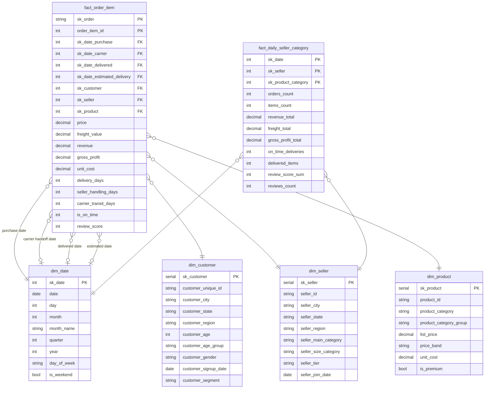
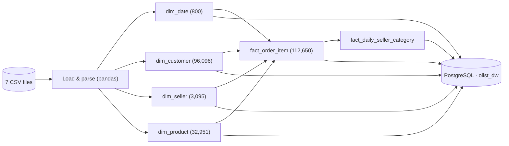

# Olist E-Commerce — Data Warehouse & BI

A data-warehouse and business-intelligence project on the [Olist Brazilian E-Commerce dataset](https://www.kaggle.com/datasets/olistbr/brazilian-ecommerce): ~100,000 orders placed on Brazil's largest online marketplace between 2016 and 2018. The project designs a Kimball star-schema warehouse, populates it with a reproducible Python (pandas) ETL pipeline into PostgreSQL, and builds Power BI reporting and OLAP tools on top.

**Stack:** Python (pandas) · PostgreSQL · Power BI  
**Scale:** 6 tables (4 dimensions, 2 facts) · 112,650 fact rows · 2016–2018

---

## Project status

| Deliverable | Status |
|---|---|
| Dimensional warehouse + reproducible ETL | Complete — 6 tables, 112,650 fact rows |
| Report A — Delivery accountability (seller vs carrier) | Complete |
| Report B — Regional freight & cost-to-serve | Complete |
| OLAP — Regional fulfilment & growth explorer | In progress |
| Executive KPI dashboard | Planned |

---

## The Raw Data

Seven CSV files from Kaggle form the foundation of this project:

| File | Rows | What it contains |
|---|---|---|
| `olist_customers_dataset.csv` | 99,441 | Customer IDs, city, state |
| `olist_orders_dataset.csv` | 99,441 | Order lifecycle: purchase, approval, delivery, and estimated delivery dates |
| `olist_order_items_dataset.csv` | 112,650 | One row per product per order — price, freight, seller, product |
| `olist_products_dataset.csv` | 32,951 | Product metadata: category name, dimensions, weight |
| `olist_sellers_dataset.csv` | 3,095 | Seller location (city, state) |
| `olist_order_reviews_dataset.csv` | 99,224 | Customer review scores (1–5) per order |
| `product_category_name_translation.csv` | 71 | Portuguese → English category name mapping |

---

## Data Model

The raw data was transformed into a **Star Schema** data warehouse — 4 dimension tables and 2 fact tables:


```mermaid
erDiagram
    dim_date {
        int sk_date PK
        date date
        int day
        int month
        string month_name
        int quarter
        int year
        string day_of_week
        bool is_weekend
    }
    dim_customer {
        serial sk_customer PK
        string customer_unique_id
        string customer_city
        string customer_state
        string customer_region
        int customer_age
        string customer_age_group
        string customer_gender
        date customer_signup_date
        string customer_segment
    }
    dim_seller {
        serial sk_seller PK
        string seller_id
        string seller_city
        string seller_state
        string seller_region
        string seller_main_category
        string seller_size_category
        string seller_tier
        date seller_join_date
    }
    dim_product {
        serial sk_product PK
        string product_id
        string product_category
        string product_category_group
        decimal list_price
        string price_band
        decimal unit_cost
        bool is_premium
    }
    fact_order_item {
        string sk_order PK
        int order_item_id PK
        int sk_date_purchase FK
        int sk_date_carrier FK
        int sk_date_delivered FK
        int sk_date_estimated_delivery FK
        int sk_customer FK
        int sk_seller FK
        int sk_product FK
        decimal price
        decimal freight_value
        decimal revenue
        decimal gross_profit
        decimal unit_cost
        int delivery_days
        int seller_handling_days
        int carrier_transit_days
        int is_on_time
        int review_score
    }
    fact_daily_seller_category {
        int sk_date PK
        int sk_seller PK
        int sk_product_category PK
        int orders_count
        int items_count
        decimal revenue_total
        decimal freight_total
        decimal gross_profit_total
        int on_time_deliveries
        int delivered_items
        int review_score_sum
        int reviews_count
    }

    fact_order_item }o--|| dim_date : "purchase date"
    fact_order_item }o--o| dim_date : "carrier handoff date"
    fact_order_item }o--o| dim_date : "delivered date"
    fact_order_item }o--o| dim_date : "estimated date"
    fact_order_item }o--|| dim_customer : ""
    fact_order_item }o--|| dim_seller : ""
    fact_order_item }o--|| dim_product : ""
    fact_daily_seller_category }o--|| dim_date : ""
    fact_daily_seller_category }o--|| dim_seller : ""
```

---

## ETL Pipeline

`etl_load_dw.py` runs the full transformation from raw CSVs to a populated warehouse in one shot:


```mermaid
flowchart LR
    A[("7 CSV files")] --> B["Load & parse (pandas)"]
    B --> C1["dim_date (800)"]
    B --> C2["dim_customer (96,096)"]
    B --> C3["dim_seller (3,095)"]
    B --> C4["dim_product (32,951)"]
    C1 & C2 & C3 & C4 --> D["fact_order_item (112,650)"]
    D --> E["fact_daily_seller_category"]
    C1 & C2 & C3 & C4 & D & E --> F[("PostgreSQL · olist_dw")]
```

---

## Field Reference

Every field in the warehouse falls into one of three categories:

> **Source** — taken directly from a Kaggle CSV  
> **Derived** — computed from source fields during ETL  
> **Simulated** — generated synthetically with a fixed random seed (42) for reproducibility

### dim_customer

| Field | Category | Notes |
|---|---|---|
| `sk_customer` | Derived | Surrogate key — auto-incremented by the DB |
| `customer_unique_id` | Source | Deduplicated from `olist_customers_dataset.csv` |
| `customer_city` | Source | |
| `customer_state` | Source | |
| `customer_region` | Derived | Mapped from state → North / Northeast / Southeast / South / Center-West |
| `customer_age` | Simulated | Uniform random 18–70 |
| `customer_age_group` | Simulated | Binned from age: 18-24 / 25-34 / 35-44 / 45-54 / 55-64 / 65+ |
| `customer_gender` | Simulated | M/F with 48%/52% split |
| `customer_signup_date` | Simulated | 60–730 random days before the customer's first order |
| `customer_segment` | Derived | Occasional (1 order) / Regular (2–4 orders) / Loyal (5+ orders) |

### dim_seller

| Field | Category | Notes |
|---|---|---|
| `sk_seller` | Derived | Surrogate key |
| `seller_id` | Source | |
| `seller_city` | Source | |
| `seller_state` | Source | |
| `seller_region` | Derived | Mapped from state |
| `seller_main_category` | Derived | Most frequently sold product category |
| `seller_size_category` | Derived | Small (<50 items) / Medium (<500) / Large (500+) |
| `seller_tier` | Derived | Bronze (<5K revenue) / Silver (<50K) / Gold (50K+) |
| `seller_join_date` | Simulated | 30–1095 random days before dataset start (Sep 2016) |
| `seller_plan` | Simulated | Subscription plan by sales volume: Free / Starter / Pro / Enterprise |
| `subscription_fee_monthly` | Simulated | Monthly SaaS fee (BRL): 0 / 99 / 299 / 699 |
| `commission_rate` | Simulated | Marketplace commission on item price: 20% / 16% / 13% / 10% |
| `payment_rate` | Simulated | Payment-processing rate: 2.97% / 2.87% / 2.77% / 2.47% |
| `active_months` | Derived | Inclusive month span of seller activity (months billed) |
| `subscription_revenue_total` | Derived | `subscription_fee_monthly × active_months` |

> **Olist revenue model (synthetic).** Olist's real revenue is *not* the item price — that is **GMV** (the seller's money). Olist earns commission + a R$5/item fee + payment processing + SaaS subscriptions. The plan, fees and commission/payment rates are **synthetically generated (fixed seed 42)**, modelled on Olist's published pricing and assigned by seller sales volume; only the R$5/item fee is exact. The **commission and payment rates live on `dim_seller`, not `dim_product`**, because Olist sets them by the seller's contracted plan — the same product sold by two sellers carries two different rates. These power the Take-Rate and Olist-revenue measures; the SaaS/platform-fee streams that require seller-plan data we do not have are approximated or omitted, and disclosed as such.

### dim_product

| Field | Category | Notes |
|---|---|---|
| `sk_product` | Derived | Surrogate key |
| `product_id` | Source | |
| `product_category` | Derived | Translated from Portuguese via translation CSV |
| `product_category_group` | Derived | Grouped by keyword (Electronics / Fashion / Health & Beauty / etc.) |
| `list_price` | Derived | Average sale price across all order items for this product |
| `price_band` | Derived | Budget (<50) / Mid (<200) / Premium (<500) / Luxury (500+) |
| `unit_cost` | Derived | `list_price × 0.60` — assumes 40% gross margin |
| `is_premium` | Derived | `TRUE` if `list_price ≥ 500` |

### fact_order_item _(high granularity — one row per order line)_

The most detailed fact table. Each row represents a single product sold within a single order — the atomic unit of the business. Use this table for any analysis that needs to drill down to individual transactions: product-level profitability, delivery performance per order, review scores, etc.

| Field | Category | Definition |
|---|---|---|
| `sk_order` | Source | Order ID from the source system |
| `order_item_id` | Source | Line number within the order (1, 2, 3… if the order has multiple products) |
| `sk_date_purchase` | Derived | FK → dim_date — the date the customer placed the order |
| `sk_date_carrier` | Derived | FK → dim_date — the date the seller handed the package to the carrier (the seller→carrier handoff, nullable) |
| `sk_date_delivered` | Derived | FK → dim_date — the date the package was actually delivered (nullable) |
| `sk_date_estimated_delivery` | Derived | FK → dim_date — the delivery date that was promised to the customer (nullable) |
| `sk_customer` | Derived | FK → dim_customer |
| `sk_seller` | Derived | FK → dim_seller |
| `sk_product` | Derived | FK → dim_product |
| `price` | Source | The amount the customer paid for the product itself (excluding shipping) |
| `freight_value` | Source | The shipping cost the customer paid for this item |
| `revenue` | Derived | `price + freight_value` — total money collected from the customer for this line |
| `unit_cost` | Derived | The estimated cost to the seller for this product (`price × 0.60`) |
| `gross_profit` | Derived | `price − unit_cost` — profit on the product before operating expenses |
| `delivery_days` | Derived | `delivered_date − purchase_date` in calendar days — total shipping time |
| `seller_handling_days` | Derived | `carrier_handoff − purchase_date` — the **seller-owned** phase (prep, pack, post), nullable |
| `carrier_transit_days` | Derived | `delivered_date − carrier_handoff` — the **carrier-owned** phase (collection, transit, last-mile), nullable |
| `is_on_time` | Derived | `1` if the package arrived on or before the estimated date, `0` if late, `NULL` if not yet delivered |
| `review_score` | Source | Customer satisfaction score for the order (1 = worst, 5 = best) |

### fact_daily_seller_category _(low granularity — daily aggregated summary)_

This table answers a different class of questions than `fact_order_item`. Instead of looking at individual transactions, it rolls everything up to the level of **one seller × one product category × one day**. This makes it fast and convenient for trend analysis, seller performance dashboards, and category comparisons over time — without scanning millions of individual order rows.

> **Example use:** "How much revenue did sellers in the Electronics category generate each day in Q4 2017, and what was their on-time delivery rate?"

Every row is built by aggregating the matching rows from `fact_order_item`. The `sk_product_category` is an integer ID (assigned alphabetically) that maps to the category name in `dim_product`.

| Field | Category | Definition |
|---|---|---|
| `sk_date` | Derived | FK → dim_date — the purchase date of the aggregated orders |
| `sk_seller` | Derived | FK → dim_seller |
| `sk_product_category` | Derived | Integer ID for the product category (alphabetically assigned; join to dim_product to get the name) |
| `orders_count` | Derived | Number of distinct orders placed |
| `items_count` | Derived | Total number of individual items sold |
| `revenue_total` | Derived | Sum of `revenue` across all matching order lines |
| `freight_total` | Derived | Sum of `freight_value` — total shipping collected |
| `gross_profit_total` | Derived | Sum of `gross_profit` — total product profit for the day |
| `on_time_deliveries` | Derived | Count of items where `is_on_time = 1` |
| `delivered_items` | Derived | Count of items that have a recorded delivery date |
| `review_score_sum` | Derived | Sum of all review scores (divide by `reviews_count` to get the average) |
| `reviews_count` | Derived | Number of items that received a review |

---

## Run it locally

<details>
<summary><b>Setup &amp; run</b> — ≈2 minutes</summary>
<br>

```bash
# 1 · dependencies
pip install pandas psycopg2-binary numpy python-dotenv

# 2 · data — place the 7 Olist CSVs next to etl_load_dw.py
#     https://www.kaggle.com/datasets/olistbr/brazilian-ecommerce

# 3 · schema — run the DDL on your PostgreSQL instance
psql -f olist_dw_schema.sql

# 4 · credentials — create .env (gitignored)
#     PG_DSN=dbname=postgres user=postgres password=*** host=127.0.0.1 port=5432

# 5 · build the warehouse (~1–2 min, prints a row count per table)
python etl_load_dw.py
```
</details>

---

## What's in this repo

| File | Purpose |
|---|---|
| `etl_load_dw.py` | Full ETL pipeline: CSVs → transform → PostgreSQL |
| `olist_dw_schema.sql` | DDL — creates the `olist_dw` schema and all 6 tables |
| `olist_dw_erd.drawio` | Interactive star schema diagram (open with [draw.io](https://app.diagrams.net)) |
| `olist_dw_erd.png` | Diagram as a static image |
| `.env` | Your local DB credentials — **not included in Git** |

---

> CSV files, `.env`, and generated documents are excluded via `.gitignore`.

---

## Report A — Olist Sellers Analysis


### Purpose
A single-page Power BI report for Olist's **seller operations team**, answering one question: *where should Olist focus fulfilment improvement to reduce customer dissatisfaction?* Total delivery time is split into a **seller-handling** and a **carrier-transit** phase to locate the bottleneck — and the evidence points to carrier transit, so the improvement focus is **logistics-partner performance**, not seller preparation.

### What it shows
Three coordinated visuals on one page, driven by a `Time Period` slicer and matrix cross-filtering (clicking a category row filters the rest):

- **Category Stats** (matrix) — Revenue, seller-count share, % Positive Reviews (≥4★), On-Time Rate, and average delivery days per product category.
- **Delivery Time Breakdown by Category** (stacked column) — average delivery days split into the seller-handling and carrier-transit phases; the carrier segment dominates every bar.
- **Delivery Days Distribution by Review Score** (box plot) — delivery time (ratio) across review scores 1–5 (ordinal); the headline visual.

Review score is treated as **ordinal** (the matrix reports *% Positive ≥4★*, not a mean of 1–5); `delivery_days` is ratio-scale, so its mean is valid.

### Key findings
- Lower review scores track with **longer delivery times** — median falls from ~19 days at 1★ to ~10 days at 5★ (association, not proven cause).
- **~80% of that gap is carrier-side**: across 1★→5★, seller handling drops 4.2→2.4 days (Δ1.8) vs carrier transit 15.0→7.8 (Δ7.2).
- The seller-vs-carrier split holds across **every** category — a platform-wide logistics pattern, not product mix.
- Satisfaction varies far more than the on-time rate (a flat ~0.90), so *how long* delivery takes matters more than beating the padded estimate.

### Known limitations
- **Gross margin is simulated** (`unit_cost = list_price × 0.60`), so it was dropped from the final matrix in favour of source-grounded delivery and satisfaction metrics.
- **No geographic dimension** here — regional analysis lives in Report B by design.
- **Delivery ↔ satisfaction is association, not proven causation.** Confounders (category, season, region, price) aren't fully controlled, so the report frames delivery as *where to investigate*, not a demonstrated cause.

### Design evolution
The visuals were revised deliberately; each earlier version is kept as a record of the correction:
- **Scatter → box plot** — the scatter treated the *ordinal* review score as a continuous axis and averaged it (invalid for ordinal data); the box plot correctly shows a ratio fact's distribution across an ordinal dimension. *(Original: [assets/report_a_v3_scatter.png](assets/report_a_v3_scatter.png).)*
- **Removed the `(Blank)` review bucket** — nullable `review_score` + a left join (99,224 of 112,650 items reviewed) put NULLs in a `(Blank)` box; fixed with a reversible visual-level filter, not a data change.
- **Revenue → delivery days** on the box-plot Y-axis — reframes the chart around a lever management controls.
- **Dropped the revenue pie + simulated-margin column** — replaced with the seller-vs-carrier breakdown to unify the page on delivery accountability.
- **Fixed a floor-truncation bug** — the matrix mean (12.01) didn't match the two-phase total (11.53) because each phase was floored independently (`floor(a)+floor(b) ≤ floor(a+b)`); the per-row residual was bounded to {0,1}, averaging 0.479 (the whole gap). Fixed by `carrier_transit_days = delivery_days − seller_handling_days` (remainder), cutting mismatched rows from 110,195 to 0. Full write-up as ISSUE #6 in [issues_and_insights.txt](issues_and_insights.txt).

